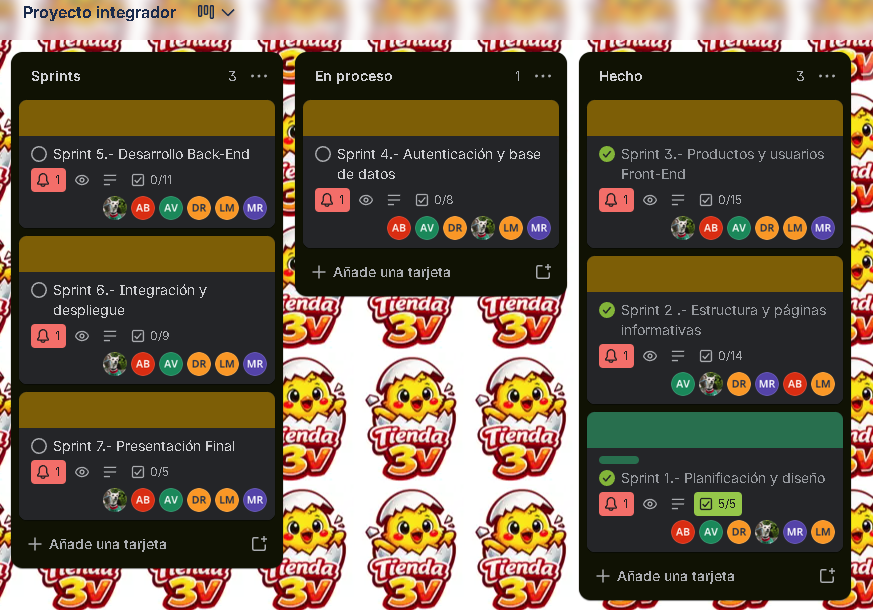

# Tiendas 3V - Proyecto Integrador

Bienvenido al repositorio del Proyecto Integrador **Tiendas 3V**, un sitio web tipo E-Commerce de abarrotes, lácteos, limpieza y productos básicos diseñado para ofrecer una experiencia de usuario rápida, moderna y responsiva.

## 🚀 Características Principales

*   **Diseño Moderno y Responsivo:** Construido con HTML5, CSS3 (paleta de colores unificada en tonos azules y neutros) y Bootstrap 5 para garantizar una correcta visualización en cualquier dispositivo móvil o de escritorio.
*   **Gestión del Carrito de Compras (Local Storage):** Funcionalidad completa y dinámica de carrito. Los productos se almacenan de manera local usando `localStorage`, permitiendo que el progreso de compra persista entre páginas (Inicio, Categorías, Detalle, etc.).
*   **Cálculo de Totales Dinámico:** El resumen de pedido en el checkout actualiza automáticamente los subtotales, totales y descuenta los cupones fijos sin necesidad de un backend o de recargar la página.
*   **Diseño Modular en JavaScript:**
    *   `global.js`: Gestión del estado global y el localStorage del carrito.
    *   `inicio.js` y `categorias.js`: Renderizado dinámico de tarjetas de productos, filtrado, paginación y adición de productos al carrito mediante eventos delegados.
    *   `carrito.js`: Manipulación en tiempo real del resumen de compra y modificación de cantidades.
*   **Recolección en Sucursal:** Incorpora opciones para "Pickup", permitiendo al cliente seleccionar una sucursal, la fecha de recolección y una selección interactiva de rangos horarios.

## 📂 Estructura del Proyecto

*   `index.html`: Página de inicio (Hero banner, ofertas destacadas, secciones).
*   `/pages/`: Páginas de navegación de la tienda.
    *   `carrito.html`: Resumen de los artículos para la simulación del pedido y selector de recolección.
    *   `categorias.html`: Grilla de productos con barra lateral para filtros (por precio, por orden, etc.).
    *   `producto.html`: Vista de detalle de un producto individual.
    *   `acerca.html`, `equipo.html`, `contacto.html`, `login.html`, `registro.html`: Páginas informativas, presentación del equipo y gestión de usuario.
*   `/css/`: Hojas de estilo unificadas y adaptadas al sistema de diseño "3V".
*   `/js/`: Scripts modulares para la lógica del E-Commerce simulado.

## 👨‍💻👩‍💻 Equipo de Desarrollo

*   **Ing. Luis Fernando Martínez Moreno** - Desarrollador Java Full Stack / Scrum Master
*   **Ing. Hannia Victoria Reyes** - Desarrollador Java Full Stack
*   **Adriana Sofía Benítez Treviño** - Desarrolladora Java Full Stack Jr.
*   **Alma Delia Vences Sánchez** - Desarrollador Java Full Stack / Scrum Master
*   **Daniel Rosas Monroy** - Desarrollador Java Full Stack
*   **Mario Javier Solano Rodríguez** - Desarrollador Java Full Stack

## 🛠️ Tecnologías Usadas

*   HTML5 & CSS3 (Diseño fluido y estricto uso de CSS Variables)
*   Bootstrap 5.3 (Grid system, Offcanvas, Modal, Utilities)
*   Vanilla JavaScript (ES6, Array functions, LocalStorage API, manipulación del DOM)

## 📌 Próximos Pasos (Futuro)
- Integración real con una pasarela de pagos.
- Fetch de productos desde un backend / base de datos mediante API REST.
- Sistema de autenticación de usuarios.

---
## Organización del Proyecto
[Tablero de Trello](https://trello.com/b/hhTkTvpJ)

**Desarrollado como proyecto integrador.**